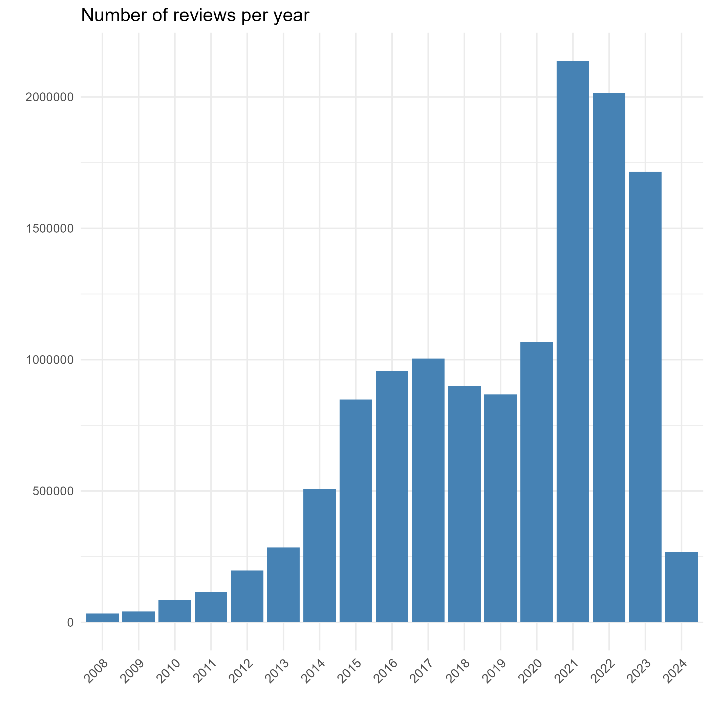
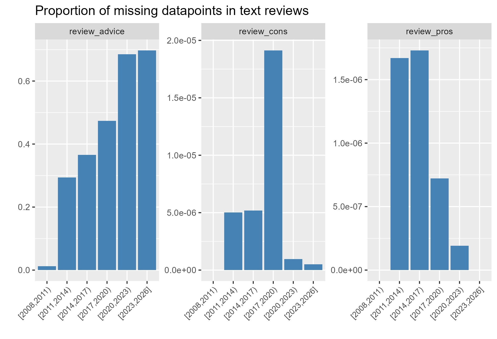
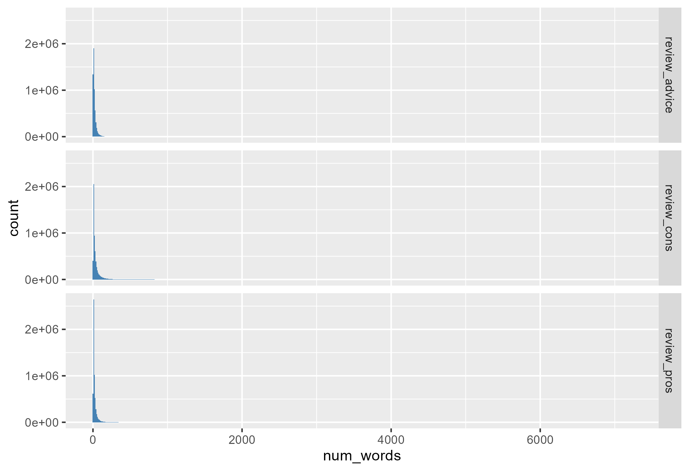
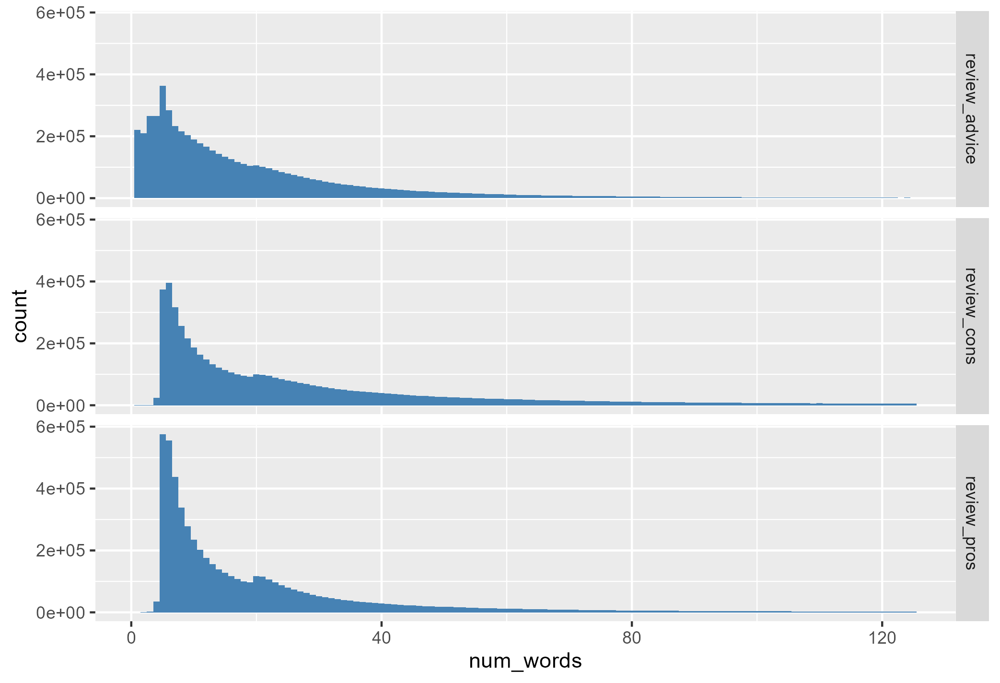
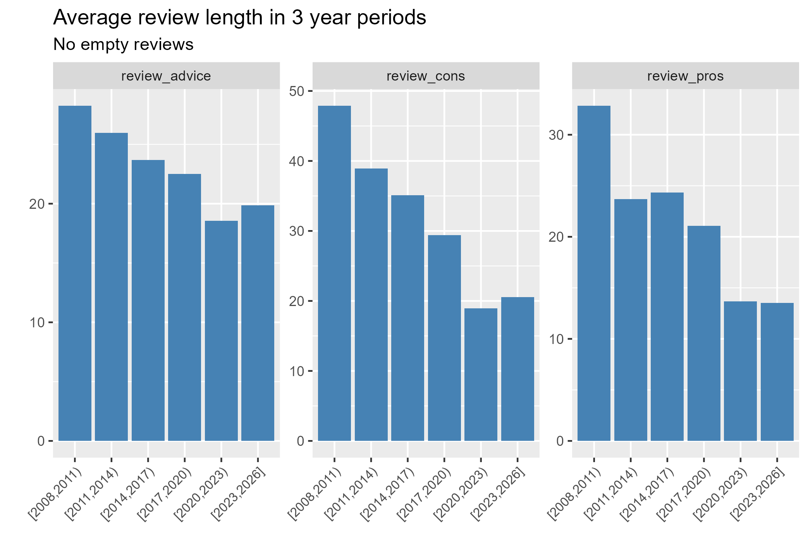

# Glassdoor reviews missingness descriptives

Code for generating this figures and for initial data cleaning can be foun on [this script.](00.glassdoor_descriptives.R)

## Reviews

We do see that most reviews are recent. The uptake could be pandemic related. Before that there is a pseudo-plateu from 2015 to 2020 at around 1 million reviews per year.

## Ratings and job info

The missingness analysis is done by grouping reviews in 3-year intervals. This means that reviews with no date are excluded from this analysis. After looking at this reviews (More detail [here](outputs/missing_dates.pdf)) I decided to exclude them from the dataset as they are mostly empty.

First I looked at missingness in non-text variables of interest: job location, job title, rating of work-life balance and overall rating. 

My guess is that overall rating is mandatory for submitting a review, so we dont get any missingness there. There are moderate to high levels of missingness in the other variables. Job location and Job title a a ton of missingness.

## Text data

Next I did a separet missingness analysis for the text variables. Complete information [here.](outputs/reviews_missingness.pdf)

Missingness in the advice for management reviews is large. On the other hand, missingness for pros and cons is almost non-existant. I think this two variables are going to be better for the analysis anyways.

### Length

Reviews tend to be short, here is a histogram of review length:

Removing outliers (2 standard deviations over the mean length).

Most reviews have less than 40 words. This supports the use of sentences transformers (i.e. BERTopic) to generate categories. There is a tendency for reviews to be shorter as time goes on:

More detailed information on text length descriptives [here.](outputs/length_descriptives.pdf)

